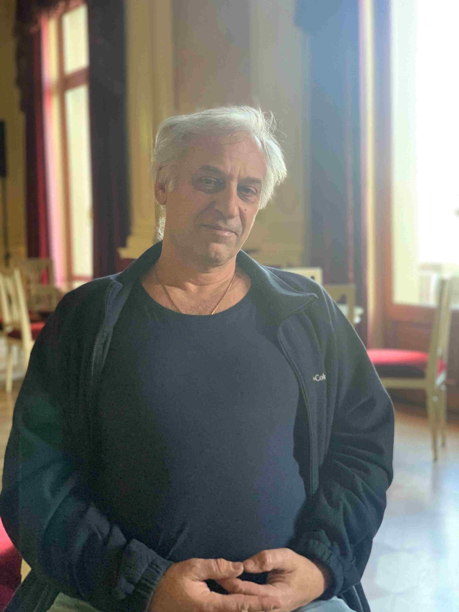

+++
title = "«Es ist schön, wenn man nach langer Zeit ein Stück auf die Bühne bringt und alles gut läuft»"
date = "2024-02-27"
draft = false
pinned = false
image = "img_4279.jpg"
+++


Paolo Rütti ist erster Bühnenmeister im Stadttheater Bern und kennt dieses wie seine Westentasche. Während das Publikum das Geschehen verfolgt, sitzt er mit seinen 35 Jahren Erfahrung hinter dem Vorhang und gibt Anweisungen. 



### Wie sind Sie auf den Beruf Bühnenmeister gekommen?

Ich habe mich eigentlich mehr für Kunst und Schauspiel interessiert. Ich habe zwar Schreiner gelernt, aber nicht mit Herzblut. In dieser Zeit war ich oft als Statist im Theater. Dann habe ich einen Schauspielkurs besucht, wo ich jemanden kennengelernt habe, der am Stadttheater gearbeitet hat. Und dann bin ich hier dazu gekommen als Bühnentechniker, das ist mittlerweile fast 35 Jahre her. Es hat mich dann interessiert mehr zu machen. Bühnenmeister ist jetzt ein bisschen anders. Früher konnte man es nur in Deutschland machen. Es gab einen Lehrgang, recht massiv, zwei Wochen Schulung und dann Prüfung. Jetzt gibt es das nicht mehr in dieser Form, sondern nur noch den Veranstaltungsmeister und das zieht sich über ein Jahr hinaus. 

### Wir haben gelesen, dass der Bühnenmeister das Bindeglied zwischen Kunst und Technik ist. Inwiefern würden Sie dem zustimmen?

Es gibt natürlich verschiedene Seiten. Die ganzen Auf- und Abbausachen des Bühnenbildes, das ist rein technisch. Wenn dann aber die Proben laufen, müssen wir reicht eng mit der Kunst zusammenarbeiten. Was muss das Bühnenbild können, was muss sich wann bewegen, wo ist was möglich in welcher Zeit? Da muss man oft auch mit Schauspielern schauen. Und dann gibt es auch noch die ganzen Sicherheitssachen. Wenn jemand fliegen soll, muss man alles klären und entsprechend umsetzen. Der Beruf bleibt aber auf der technischen Seite, wir geben keine kreativen Tipps. 

### Was passiert genau bei einem Szenenwechsel?

Es kann gar nichts passieren oder es kann ganz vieles passieren. Das Ganze hat sich verändert. Noch vor 15-20 Jahren gab es komplette Szenenwechsel, wo man ganze Räume um- und neugebaut hat. Heute gibt es das auch, aber wir arbeiten mehr mit kleineren Dingen während den Szenen. Die Bühne ist in Segmente unterteilt, die auffahren können und damit können wir beispielsweise ein ganzes Bühnenbild hochfahren. Dann haben wir Stangen, an denen sogenannte Prospekte hängen. Das sind riesige Bilder, auf denen alles sein kann. Dann kann es regnen, schneien… Es kann auch sein, dass es nichts zu verschieben gibt und wir nur einen schwarzen Aushang im Hintergrund aufhängen. 

### Wie schafft man es, die Stimmung so rüberzubringen, wie sie sein sollte?

Das ist vor allem eine Frage des Lichts. Damit kann man sehr viele verschiedene Unterschiede rausholen. Das andere sind Effekte wie Schnee, Regen, Rauch, Trockeneis… schlussendlich ist das Licht aber ausschlaggebend. 

### Kommt es vor, dass es Konflikte oder Meinungsverschiedenheiten mit Darsteller\*innen oder Regisseur\*innen gibt, wegen verschiedenen Vorstellungen?

Die Kunst hat ihre Vorstellungen und beim Prozess dorthin kann es schon Konflikte geben. Bevor ein Bühnenbild fertig gebaut ist, müssen Bühnenbildner und Regie ein Konzept erarbeiten. Dies wird eingereicht und dann gibt es eine Dimensions-Bauprobe. Dort wird also das erste Mal festgehalten, wie die Dimensionen der Bühne ungefähr sind. Als Bühnenmeister ist man auch bei der Konstruktionsbesprechung dabei mit Handwerkern, Schreinern und Metallbauern. Dort wird dann die beste Lösung gesucht und dann wird es gebaut. Natürlich können die Bühnenbildner immer noch intervenieren, aber eher bei kleineren Dingen wie die Farb-Nuancen. Es ist auch schon vorgekommen, dass die Regie mit dem fertigen Bühnenbild nicht zufrieden war. Das passiert aber nur selten, da man sich während des Prozesses immer wieder austauscht. Wenn etwas jedoch sicherheitstechnisch nicht umsetzbar ist, gibt es für uns keine Kompromisse.

### Was machen sie und Ihr Team, wenn während der Vorstellung etwas schiefläuft?

Es kommt sehr darauf an. Wenn es etwas Gravierendes ist, dann wird sofort der Vorhang geschlossen. Sonst probiert man den Fehler so zu überspielen, dass es die Zuschauer nicht merken. Meistens passieren aber keine solchen gravierenden Fehler. Es kommt vor, dass die Schauspieler die Requisiten nicht an den richtigen Ort verschieben. Besonders wenn es mit dem Verlauf des Stücks in Abhängigkeit steht, kann es zu einem Problem werden. Das sind aber immer noch Dinge, die im besten Fall nicht ersichtlich sind für den Zuschauer. 

### Was ist der Lieblingsteil eurer Arbeit?

Ferien \*lacht\*. Nein, natürlich ist es schön, wenn man nach langer Arbeit ein Stück auf die Bühne bringen kann und bei der Premiere alles gut läuft. Gleichzeitig ist das aber auch der anstrengendste Teil. Bei mir ist es so, dass ¾ meiner Arbeit aus Administration besteht. Der Rest ist bei mir ein eher kleinerer Teil, bei anderen Bühnenmeistern kann das aber auch anders aussehen. Aber im Mittelpunkt steht trotzdem der Bühnenbetrieb.

### Glauben Sie, es besteht die Gefahr, dass der Beruf Bühnenbildner in Zukunft durch KI oder Roboter ersetzt wird?

Nein. Klar gibt es Veränderungen, die ich nicht unbedingt gut finde. Im Allgemeinen sehe ich aber beim Beruf Veranstaltungsmeister eher eine Gefahr, weil es da keinerlei handwerklichen Hintergrund braucht und das eigentlich fast jeder machen könnte. Aber bei mir sehe ich weniger die Gefahr, weil man zum Beispiel die Leute auf der Bühne direkt führen und sich absprechen muss. Unser Beruf beinhaltet viel Menschliches und auch Dinge, die nicht berechnet werden können. Es wäre wahrscheinlich schon irgendwie möglich, dass die KI Teile des Berufes übernimmt. Im Ganzen ist der Beruf Bühnenmeister aber sehr aufwändig und deshalb bezweifle ich, dass künstliche Intelligenz uns komplett ersetzen könnte.