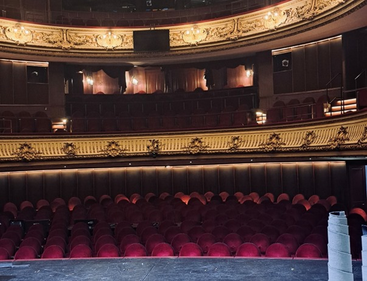

+++
title = "Im Schatten der Bühne"
date = "2024-02-20"
draft = false
pinned = false
image = "whatsapp-bild-2024-02-20-um-13.59.31_c0dfc670.jpg"
+++
#### Das Publikum starrt auf den Boden der Bühne. Er bewegt sich langsam nach oben und nimmt die ganze Kulisse mit. Nach wenigen Sekunden sind die künstlichen Schneeflocken die einzigen Überreste des eben noch dagewesenen Bühnenbildes. Während sich die Leute in den Sitzreihen- und Rängen auf die nächsten Momente vorbreiten, sind elf Techniker*innen hinter dem Schauspiel hochkonzentriert auf ihre Arbeit fokussiert.

Ladina Bähler, Anik Schranz

Vom Trottoir führt eine Treppe direkt zum Hintereingang der Bühne. Es sieht beinahe aus wie die Tür zu einer normalen Wohnung. Einzig der Schriftzug «Bühne» über dem grauen Holz lässt erahnen, was sich dahinter abspielen könnte. Die Uhr hinter der Tür ist defekt und am Empfang sitzt eine Dame, ungefähr 50. Sie trägt ihre frechen Locken offen bis zu den Schultern und drückt den Hörer des Telefons an ihr Ohr. Die Kartonkisten und ein Geigenkasten stehen gestapelt auf etwas, das wohl eine Bank sein soll und sorgen dafür, dass der Durchgang noch enger wird. Wenn die Tür aufschwingt, stürzen wuschig wirkende Künstler\*innen herein und schenken der Frau hinter dem Tresen ein Lächeln und ein knappes Hallo. Ständig wird telefoniert und die Leute sprechen miteinander und übereinander. «Ist der Franco schon aus den Ferien zurück? Ich müsste nämlich mit ihm telefonieren», «Nein, der ist noch nicht wieder hier». Plötzlich ist der Franco aber an der anderen Leitung des Telefons. «Ach, hallo Franco». Während Franco für noch mehr Chaos sorgt, betritt Paolo Rütti, erster Bühnenmeister des Stadttheaters Bern, den kleinen Raum. Er trägt ein dunkelblaues T-Shirt, darüber eine schwarze Jacke und basic Jeans. Die Goldkette, die um seinen Hals liegt, fällt bei dem schlichten Outfit auf. In seiner rechten Jeanstasche befindet sich sein Arbeitstelefon, das ihm den schnellen Kontakt mit Mitarbeiter\*innen ermöglicht. Paolo geht zielstrebig in die Loge, wo zu dieser Uhrzeit kein Betrieb ist. Drei prunkvolle Kronleuchter schmücken die kunstvoll verzierte Decke des Raumes und sorgen dafür, dass das beeindruckende Wandbild nicht das einzige ist, das die Aufmerksamkeit auf sich zieht. Paolo in seiner normalen Arbeitskleidung passt nicht so ganz ins Bild. Trotzdem setzt er sich mit einer Selbstverständlichkeit auf einen mit rotem Stoff überzogenen Stuhl und beginnt zu erzählen. 

##### 1. Untertitel

Glücklich ist er erst, wenn die Premiere erfolgreich gemeistert wurde. Vorher fordert die Arbeit die volle Konzentration des Bühnenmeisters. Als Bühnenmeister ist Paolo Rütti nämlich zuständig für alles, was auf und hinter der Bühne passiert. Sowohl vor, während, als auch nach einer Theateraufführung, einer Tanzvorstellung oder einer Oper. Er sorgt zusammen mit den Bühnenbildner\*innen dafür, dass das Bühnenbild möglichst den Vorstellungen der Regisseurin entspricht. Es kann natürlich nicht vermieden werden, dass dies ab und an nicht gelingt. Dass es von den Materialien oder von der Sicherheit her nicht möglich ist. Es kommt jedoch laut Rütti eher selten vor, dass ein Bühnenbild nicht der Vorstellung der Regisseurin entspricht, da während der Vorbereitung eines Theaterstückes regelmässig Sitzungen gehalten werde, an denen sowohl der Regisseur als auch die Bühnenbildner\*innen und natürlich der Bühnenmeister teilnehmen. In diesen Sitzungen wird alles genau besprochen, sodass das Bühnenbild seine volle Wirkung haben kann. Ausserdem bestimmt er gemeinsam mit den Techniker*innen und dem Regisseur, wie das Licht an welcher Stelle sein soll.

> «Das ist vor allem eine Frage des Lichts» 
>
> *Paolo Rüttis Antwort auf die Frage, was wichtig für die Stimmung im Bühnenbild sei*

Natürlich sorgen heute im Saal auch Effekte wie Rauch, künstlicher Schnee oder Regen dafür, dass die Zuschauer*innen nach der Aufführung begeistert zu klatschen beginnen. 

##### Vom Schreiner zur Bühnenlegende

Der Prachtvolle Saal des Stadttheaters Bern füllt sich immer mehr mit Leuten, die sich voller Vorfreude auf die Premiere des Theaterstücks «die Physiker», auf die roten, bequemen Stühle setzen. Das Licht geht aus, der Saal wird ruhig und das humorvolle Theaterstück beginnt. Während sich die Leute das Spektakel ansehen, arbeiten hinter den Kulissen viele Menschen konzentriert daran, das Ganze genauso rüberzubringen, wie es in den vielen Proben zuvor geklappt hat. Das Theaterstück kann reibungslos vorgeführt werden, denn selbst wenn es einen Fehler gegeben hätte, wäre dieser geschickt von den Schauspieler\*innen überspielt worden und unbemerkt geblieben. Zu Fehlern kommt es aber laut Rütti nur sehr selten und die meisten sind auch einfach zu verbergen. Falls mal etwas Gravierendes passiert, wird der Vorhang geschlossen. 
Im Theaterstück «die Physiker» gibt es nur einmal einen Szenenwechsel, der das Bühnenbild betrifft. Dafür ist dieser ziemlich beeindruckend. Das ganze Bühnenbild schwebt nach oben und dreht sich dabei. Übrig bleibt nur «Der Schnee von gestern», im wahrsten Sinne des Wortes. Der künstliche Schnee bleibt als kleinen, weissen Teppich am Boden liegen. Der ganze Wechsel sorgt für einen fantastischen Effekt, der dem Theaterstück eine weitere einzigartige Note gibt. Obwohl dieser Szenenwechsel beeindruckend ist, überlegt sich kaum jemand, dass beinahe ein duzend Menschen hinter der Kulisse dafür gesorgt haben, dass diese Veränderung des Bühnenbilds reibungslos abläuft. Tapezierer\*innen bringen in Windeseile die Requisiten weg, die Beleuchter\*innen kümmern sich um die Lichtwechsel, während die Techniker\*innen mit Hilfe von Stangen und Bühnensegmenten die neuen Bildelemente für die nächste Szene aufbauen, oder eben auch nicht, je nach dem, was es braucht. 
Unter diesen Leuten ist auch Paolo Rütti, der Bühnenmeister. Er hat das Geschehen im Blick und gibt Anweisungen. 

An Kunst und Schauspiel interessiert, Schreiner gelernt. Paolo Rütti hat schon während seiner Ausbildung zum Schreiner als Statist im Theater gearbeitet und das hat sein Interesse geweckt. Sosehr, dass er kurz darauf den Schauspielkurs besuchte, wo er jemanden kennenlernte, der im Stadttheater Bern arbeitete. Als Herr Rütti dann als Bühnentechniker eingestellt wurde, begann seine mittlerweile 35 Jahre alte Karriere in den prunkvollen Mauern des Theaters. In der Zeit habe sich viel verändert, sagt der erste Bühnenmeister. Früher baute man bei Szenenwechseln oft ganze Räume um und es kamen welche dazu, heute arbeitet man eher mit kleinen Dingen während den Szenen. Die Technik hat sich natürlich auch verbessert, denn heute hat man die Möglichkeit, ganze Bühnenbilder auf Gerüsten in beliebige Richtungen zu bewegen, während früher alles viel mühsamer ablief. Paolo Rütti kommt aber mit allem klar, er ist schliesslich seit vielen Jahren der erste Bühnenmeister und schon fast eine Bühnenlegende des Theaters. 

`Den Beruf «Bühnenmeister*in» konnte man früher noch nicht so leicht erlernen. Die Ausbildung dazu konnte nur in Deutschland als Lehrgang absolviert werden und dauerte knappe vier Monate. Zwei Wochen Schulung, drei Monate später die Prüfung und alles musste sitzen. Heute gibt es auch in der Schweiz die Möglichkeit, Bühnenmeister*in zu werden. Die Ausbildung dazu nennt sich «Veranstaltungsmeister*in» und zieht sich über ein Jahr hinweg, wo der Stoff in verschiedenen Blöcken gelernt wird.`

##### 3. Untertitel

Hinter dem Vorhang bleibt die Menschlichkeit unersetzbar. Die Frage, ob der Beruf als Bühnenmeister gefährdet ist, in Zukunft durch künstliche Intelligenz ersetzt zu werden, beantwortet Paolo Rütti mit einem sicheren «nein». Allein die Dienstpläne, die meistens sehr unregelmässig sind, könnten kaum von künstlicher Intelligenz geplant werden. Die Arbeit hat auch viele persönliche Aspekte, besonders weil man mit so vielen verschiedenen Menschen Kontakt hat. Denn obwohl man es vielleicht nicht erwarten würde, ist die Stimmung unter den Mitarbeitenden des Theaters sehr familiär. Die Leute haben sich wie eine grosse Familie aufgebaut und der Umgang ist meist freundlich. Von aussen sieht das Theater förmlich, ordentlich und vor allem sehr prächtig aus. Wenn man jedoch hinter die Kulisse schaut, merkt man, dass nicht jeder Raum so edel ist und die Leute auch nicht ernst und konventionell sind, wie man vielleicht denken würde. Ein Blick hinter den Vorhang genügt, um zu merken, dass der erste Eindruck täuschen kann.